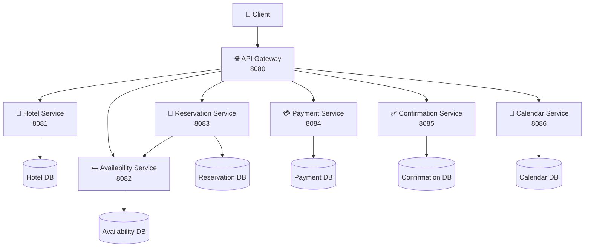
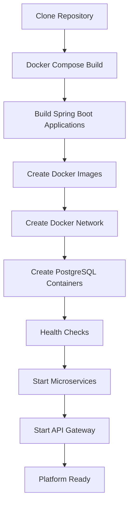
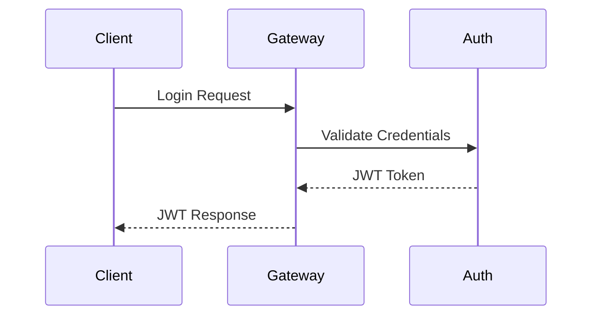
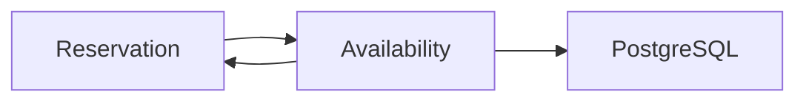
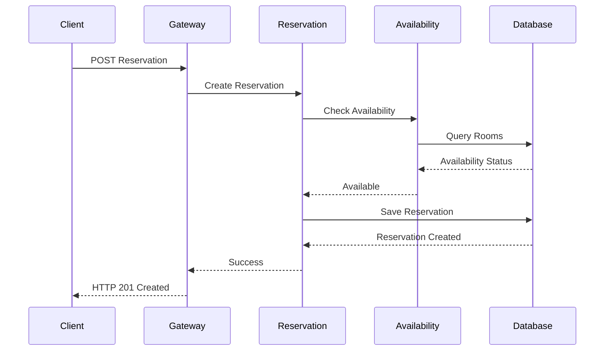
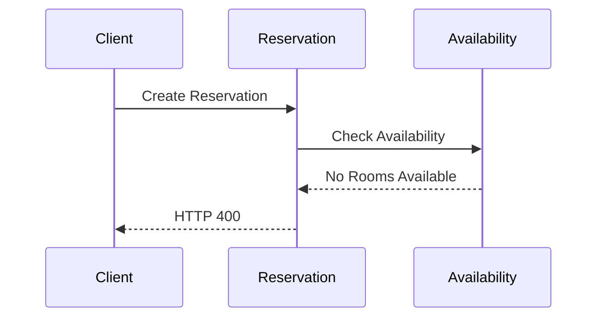
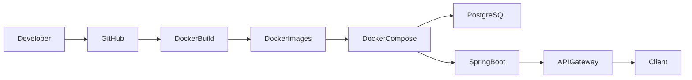
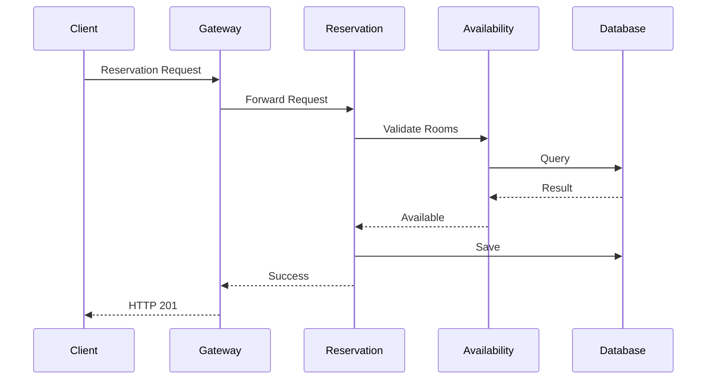

<!-- ========================================================= -->
<!--                 HOTEL RESERVATION PLATFORM                 -->
<!-- ========================================================= -->

# 🏨 Hotel Reservation Platform

<div align="center">

## Plataforma de Reservaciones Hoteleras basada en Microservicios

### Arquitectura Orientada a Servicios (SOA)

Sistema distribuido desarrollado con **Spring Boot 4**, **Java 21**, **PostgreSQL**, **Docker Compose** y **JWT Authentication**, implementando una arquitectura de microservicios completamente desacoplada y desplegable mediante contenedores Docker.

---


---


</div>

---

# 📖 Table of Contents

- [Overview](#-overview)
- [Project Objectives](#-project-objectives)
- [Main Features](#-main-features)
- [System Architecture](#-system-architecture)
- [Architecture Diagram](#-architecture-diagram)
- [Technology Stack](#-technology-stack)
- [Implemented Microservices](#-implemented-microservices)
- [Repository Structure](#-repository-structure)
- [Installation](#-installation)
- [Docker Deployment](#-docker-deployment)
- [Environment Variables](#-environment-variables)
- [API Gateway](#-api-gateway)
- [JWT Authentication](#-jwt-authentication)
- [Reservation Workflow](#-reservation-workflow)
- [REST API](#-rest-api)
- [Swagger Documentation](#-swagger-documentation)
- [Testing](#-testing)
- [Future Improvements](#-future-improvements)
- [Author](#-author)

---

# 📌 Overview

The **Hotel Reservation Platform** is a distributed application developed under the principles of **Service-Oriented Architecture (SOA)** using a **microservices-based architecture**.

Instead of concentrating all business logic in a monolithic application, the system is divided into independent services responsible for specific business capabilities.

Each microservice owns:

- Its own source code
- Its own REST API
- Its own PostgreSQL database
- Independent deployment
- Independent scalability

The communication between services is performed through REST APIs while all client requests are centralized through an **API Gateway**.

This architecture increases:

- Maintainability
- Scalability
- Fault isolation
- Deployment flexibility
- Technology independence

---

# 🎯 Project Objectives

The main objective of this project is to demonstrate the implementation of a complete distributed platform applying modern software engineering practices such as:

- Microservices Architecture
- Service-Oriented Architecture (SOA)
- API Gateway Pattern
- Database per Service Pattern
- JWT Authentication
- Docker Containerization
- Docker Compose Orchestration
- RESTful API Design
- OpenAPI Documentation
- Independent Service Deployment

---

# ✨ Main Features

✔ Seven independent Spring Boot microservices

✔ API Gateway as single entry point

✔ JWT Authentication

✔ PostgreSQL database per service

✔ Docker Compose deployment

✔ Swagger/OpenAPI documentation

✔ Independent Docker containers

✔ Independent Docker networks

✔ Persistent Docker volumes

✔ REST communication between services

✔ Availability validation before reservations

✔ Global exception handling

✔ Jakarta Bean Validation

✔ DTO architecture

✔ Layered Architecture

✔ Production-ready project structure

---

# 🏗️ System Architecture

The platform follows a distributed microservices architecture.

```
                        Client

                           │
                           │ HTTP
                           ▼

                   API Gateway :8080

                           │
        ┌──────────────────┼─────────────────────┐
        │                  │                     │
        ▼                  ▼                     ▼

Hotel Service      Reservation Service     Payment Service

        │                  │
        │                  ▼
        │         Availability Service
        │                  │
        │                  ▼
        │        Confirmation Service
        │                  │
        │                  ▼
        │          Calendar Service
```

Every service owns its own PostgreSQL database.

---

# 📊 Architecture Diagram



---

# 💻 Technology Stack

## Programming Language

- Java 21

## Backend Framework

- Spring Boot 4.0.6

## REST API

- Spring Web

## Persistence

- Spring Data JPA

## Database

- PostgreSQL

## Security

- Spring Security
- JWT

## Validation

- Jakarta Validation

## Build Tool

- Maven Wrapper

## Documentation

- Swagger / OpenAPI

## Containers

- Docker
- Docker Compose

## Testing

- Postman

## Version Control

- Git
- GitHub

---

# 🚀 Implemented Microservices

| Microservice | Description | Port | Database |
|--------------|------------|------|----------|
| **API Gateway** | Centralized routing | **8080** | — |
| **Hotel Service** | Hotel management | **8081** | hotel_service_db |
| **Availability Service** | Room availability | **8082** | availability_service_db |
| **Reservation Service** | Reservation management | **8083** | reservation_service_db |
| **Payment Service** | Payment processing | **8084** | payment_service_db |
| **Confirmation Service** | Reservation confirmation | **8085** | confirmation_service_db |
| **Calendar Service** | Reservation calendar | **8086** | calendar_service_db |

---

# ⭐ Key Design Decisions

The following architectural patterns were applied throughout the platform:

- API Gateway Pattern
- Database per Service Pattern
- Layered Architecture
- DTO Pattern
- Dependency Injection
- Repository Pattern
- Service Pattern
- Global Exception Handling
- JWT Authentication
- Docker Containerization
- Docker Compose Orchestration

---

# 📂 Repository Structure

The project follows a modular architecture where each microservice is completely independent.

```text
hotel-reservation-platform
│
├── api-gateway/
│   ├── src/
│   ├── Dockerfile
│   ├── pom.xml
│   └── README.md
│
├── hotel-service/
│   ├── src/
│   ├── Dockerfile
│   ├── pom.xml
│   └── README.md
│
├── availability-service/
│   ├── src/
│   ├── Dockerfile
│   ├── pom.xml
│   └── README.md
│
├── reservation-service/
│   ├── src/
│   ├── Dockerfile
│   ├── pom.xml
│   └── README.md
│
├── payment-service/
│   ├── src/
│   ├── Dockerfile
│   ├── pom.xml
│   └── README.md
│
├── confirmation-service/
│   ├── src/
│   ├── Dockerfile
│   ├── pom.xml
│   └── README.md
│
├── calendar-service/
│   ├── src/
│   ├── Dockerfile
│   ├── pom.xml
│   └── README.md
│
├── compose.yaml
│
├── LICENSE
│
└── README.md
```

---

# ⚙️ Prerequisites

Before running the project, make sure the following software is installed on your machine.

| Software | Version |
|----------|----------|
| Java | 21 |
| Maven | 3.9+ |
| Docker Desktop | Latest |
| Docker Compose | v2+ |
| Git | Latest |

Verify your installation:

```bash
java -version
```

```bash
mvn -version
```

```bash
docker --version
```

```bash
docker compose version
```

---

# 🚀 Quick Start

## 1. Clone the repository

```bash
git clone https://github.com/YOUR_USERNAME/hotel-reservation-platform.git
```

Move into the project directory:

```bash
cd hotel-reservation-platform
```

---

## 2. Build all Docker images

```bash
docker compose build
```

Docker will automatically:

- Build all seven Spring Boot applications
- Download dependencies
- Package every application
- Create Docker images

---

## 3. Start the platform

```bash
docker compose up -d
```

Docker Compose automatically:

- Creates the Docker network
- Creates persistent volumes
- Starts PostgreSQL containers
- Waits until databases become healthy
- Starts every Spring Boot microservice
- Starts the API Gateway

---

## 4. Verify containers

```bash
docker compose ps
```

Expected output:

```text
NAME                         STATUS
hotel-db                     healthy
availability-db              healthy
reservation-db               healthy
payment-db                   healthy
confirmation-db              healthy
calendar-db                  healthy

hotel-service                Up
availability-service         Up
reservation-service          Up
payment-service              Up
confirmation-service         Up
calendar-service             Up

api-gateway                  Up
```

---

## 5. Stop the platform

```bash
docker compose down
```

Volumes remain intact.

---

## 6. Remove everything

```bash
docker compose down -v
```

This command removes:

- Containers
- Networks
- Volumes

Use it only if you want to reset the databases.

---

# 🐳 Docker Compose Architecture

The entire platform is orchestrated using Docker Compose.

The infrastructure consists of:

| Component | Quantity |
|-----------|----------|
| API Gateway | 1 |
| Spring Boot Microservices | 6 |
| PostgreSQL Databases | 6 |
| Docker Network | 1 |
| Persistent Volumes | 6 |

Total:

**13 running containers**

---

# 📦 Docker Images

Each microservice is packaged independently.

| Image | Description |
|--------|-------------|
| api-gateway | API Gateway |
| hotel-service | Hotel Management |
| availability-service | Room Availability |
| reservation-service | Reservation Management |
| payment-service | Payments |
| confirmation-service | Confirmations |
| calendar-service | Reservation Calendar |

---

# 📁 Docker Volumes

Persistent storage is implemented using Docker Volumes.

| Volume | Purpose |
|---------|---------|
| hotel-db-data | Hotel database |
| availability-db-data | Availability database |
| reservation-db-data | Reservation database |
| payment-db-data | Payment database |
| confirmation-db-data | Confirmation database |
| calendar-db-data | Calendar database |

Data remains available even after containers are restarted.

---

# 🌐 Docker Network

All containers communicate through an isolated Docker bridge network.

```text
hotel-platform-network
```

Internal communication uses service names instead of IP addresses.

Example:

```text
http://availability-service:8082
```

instead of

```text
http://localhost:8082
```

This enables seamless communication between containers.

---

# 🔧 Environment Variables

The project uses environment variables to support both local execution and Docker deployment.

## Common Variables

| Variable | Description |
|----------|-------------|
| SERVER_PORT | Service listening port |
| SPRING_DATASOURCE_URL | PostgreSQL connection URL |
| SPRING_DATASOURCE_USERNAME | PostgreSQL username |
| SPRING_DATASOURCE_PASSWORD | PostgreSQL password |
| SPRING_JPA_HIBERNATE_DDL_AUTO | Hibernate strategy |
| SPRING_JPA_SHOW_SQL | SQL logging |

Reservation Service additionally uses:

| Variable | Description |
|----------|-------------|
| AVAILABILITY_SERVICE_URL | Availability Service URL |

API Gateway additionally uses:

| Variable | Description |
|----------|-------------|
| HOTEL_SERVICE_URL | Hotel Service |
| AVAILABILITY_SERVICE_URL | Availability Service |
| RESERVATION_SERVICE_URL | Reservation Service |
| PAYMENT_SERVICE_URL | Payment Service |
| CONFIRMATION_SERVICE_URL | Confirmation Service |
| CALENDAR_SERVICE_URL | Calendar Service |

---

# 🔌 Port Mapping

## Application Ports

| Service | Port |
|----------|------|
| API Gateway | 8080 |
| Hotel Service | 8081 |
| Availability Service | 8082 |
| Reservation Service | 8083 |
| Payment Service | 8084 |
| Confirmation Service | 8085 |
| Calendar Service | 8086 |

---

## PostgreSQL Ports

| Database | Port |
|-----------|------|
| Hotel DB | 5433 |
| Availability DB | 5434 |
| Reservation DB | 5435 |
| Payment DB | 5436 |
| Confirmation DB | 5437 |
| Calendar DB | 5438 |

---

# 🗄️ Database Strategy

Following the **Database per Service** architectural pattern, every microservice owns its own PostgreSQL database.

Advantages include:

- Independent schema evolution
- Better fault isolation
- Independent scalability
- Loose coupling
- Higher maintainability

---

# 🐳 Dockerfile Strategy

Every microservice uses a multi-stage Dockerfile.

Benefits:

- Smaller runtime images
- Faster deployments
- Cleaner builds
- Better cache utilization
- Production-ready containers

---

# 🔄 Deployment Workflow



---

# ✅ Deployment Verification Checklist

After deployment verify:

- [ ] Docker Desktop is running
- [ ] All images are built
- [ ] All PostgreSQL containers are healthy
- [ ] All Spring Boot services are running
- [ ] API Gateway is available on port 8080
- [ ] Docker network has been created
- [ ] Docker volumes have been created
- [ ] Swagger UI is accessible
- [ ] JWT authentication works correctly
- [ ] Inter-service communication is successful

---

# 🌐 API Gateway

The platform exposes a **single entry point** through an API Gateway.

Instead of communicating directly with each microservice, every client request is routed through the Gateway.

```
                    Client
                       │
                       ▼
               API Gateway :8080
                       │
       ┌───────────────┼────────────────┐
       ▼               ▼                ▼
 Hotel Service   Reservation      Payment Service
                 Service
```

Advantages:

- Single public endpoint
- Centralized routing
- Simplified client architecture
- Security enforcement
- Easier scalability
- Future support for rate limiting, logging and monitoring

---

## Base URL

```
http://localhost:8080
```

Every REST endpoint is accessed through this address.

---

# 🔐 JWT Authentication

The platform uses **JSON Web Tokens (JWT)** for authentication and authorization.

Once authenticated, the client receives a signed token that must accompany every protected request.

## Authentication Flow



---

## Login Request

```
POST /api/auth/login
```

Example:

```json
{
    "username":"admin",
    "password":"admin123"
}
```

---

## Login Response

```json
{
    "token":"eyJhbGciOiJIUzI1NiIsInR5cCI..."
}
```

---

## Using the Token

Every protected endpoint requires the following HTTP Header:

```
Authorization: Bearer YOUR_JWT_TOKEN
```

Example:

```
Authorization: Bearer eyJhbGc...
```

---

## Authentication Benefits

- Stateless authentication
- No server-side sessions
- Better scalability
- Standard REST security
- Easy integration with API Gateway

---

# 🔄 Inter-Service Communication

The platform implements synchronous REST communication between microservices.

Currently the business workflow involves:

```
Reservation Service

↓

Availability Service
```

Before a reservation is stored, the Reservation Service verifies that rooms are available.

---

## Communication Diagram



---

## Internal URLs

Inside Docker Compose the services communicate using container names.

Example:

```
http://availability-service:8082
```

instead of

```
http://localhost:8082
```

This avoids dependency on host networking.

---

# 🏨 Reservation Workflow

The reservation process follows the sequence below.



---

## Reservation Steps

### Step 1

The client sends a reservation request.

↓

### Step 2

The API Gateway routes the request.

↓

### Step 3

Reservation Service receives the request.

↓

### Step 4

Reservation Service contacts Availability Service.

↓

### Step 5

Availability Service validates room availability.

↓

### Step 6

If rooms are available:

- Reservation is stored.
- HTTP 201 is returned.

↓

### Step 7

If rooms are unavailable:

- Reservation is rejected.
- Error response is returned.

---

# ❌ Reservation Rejection Flow



---

# 📡 REST API

## Hotel Service

| Method | Endpoint | Description |
|---------|----------|-------------|
| GET | `/api/hotels` | Get all hotels |
| GET | `/api/hotels/{id}` | Get hotel by ID |
| POST | `/api/hotels` | Create hotel |
| PUT | `/api/hotels/{id}` | Update hotel |
| DELETE | `/api/hotels/{id}` | Delete hotel |

---

## Availability Service

| Method | Endpoint |
|---------|----------|
| GET | `/api/availability` |
| GET | `/api/availability/{id}` |
| POST | `/api/availability` |
| PUT | `/api/availability/{id}` |
| DELETE | `/api/availability/{id}` |

---

## Reservation Service

| Method | Endpoint |
|---------|----------|
| GET | `/api/reservations` |
| GET | `/api/reservations/{id}` |
| POST | `/api/reservations` |
| PUT | `/api/reservations/{id}` |
| DELETE | `/api/reservations/{id}` |

---

## Payment Service

| Method | Endpoint |
|---------|----------|
| GET | `/api/payments` |
| GET | `/api/payments/{id}` |
| POST | `/api/payments` |
| PUT | `/api/payments/{id}` |
| DELETE | `/api/payments/{id}` |

---

## Confirmation Service

| Method | Endpoint |
|---------|----------|
| GET | `/api/confirmations` |
| GET | `/api/confirmations/{id}` |
| POST | `/api/confirmations` |
| PUT | `/api/confirmations/{id}` |
| DELETE | `/api/confirmations/{id}` |

---

## Calendar Service

| Method | Endpoint |
|---------|----------|
| GET | `/api/calendar` |
| GET | `/api/calendar/{id}` |
| POST | `/api/calendar` |
| PUT | `/api/calendar/{id}` |
| DELETE | `/api/calendar/{id}` |

---

# 🔗 API Gateway Routes

| Gateway Route | Destination |
|---------------|-------------|
| `/api/hotels/**` | Hotel Service |
| `/api/availability/**` | Availability Service |
| `/api/reservations/**` | Reservation Service |
| `/api/payments/**` | Payment Service |
| `/api/confirmations/**` | Confirmation Service |
| `/api/calendar/**` | Calendar Service |

---

# 📥 Example Request

```http
POST /api/reservations
Authorization: Bearer YOUR_TOKEN
Content-Type: application/json
```

```json
{
    "hotelId":1,
    "roomType":"DOUBLE",
    "checkInDate":"2026-08-15",
    "checkOutDate":"2026-08-18",
    "guestName":"John Doe"
}
```

---

# 📤 Example Response

```json
{
    "id":1,
    "status":"CONFIRMED",
    "message":"Reservation created successfully."
}
```

---

# ⚠️ Error Response Example

If there is no availability:

```http
HTTP/1.1 400 Bad Request
```

```json
{
    "timestamp":"2026-07-27T18:30:12",
    "status":400,
    "error":"Bad Request",
    "message":"No rooms available for the selected dates."
}
```

---

# 🛡️ Security Summary

✔ JWT Authentication

✔ Stateless Sessions

✔ Protected REST Endpoints

✔ API Gateway Routing

✔ Secure Inter-Service Communication

✔ Centralized Request Entry

---

# 📚 Swagger / OpenAPI Documentation

Each microservice includes its own interactive API documentation using **Springdoc OpenAPI**.

Swagger allows developers to:

- Explore every REST endpoint
- Execute requests directly from the browser
- Validate request and response models
- Test JWT protected endpoints
- Improve API discoverability

---

## Swagger URLs

| Service | Swagger UI |
|----------|------------|
| Hotel Service | http://localhost:8081/swagger-ui/index.html |
| Availability Service | http://localhost:8082/swagger-ui/index.html |
| Reservation Service | http://localhost:8083/swagger-ui/index.html |
| Payment Service | http://localhost:8084/swagger-ui/index.html |
| Confirmation Service | http://localhost:8085/swagger-ui/index.html |
| Calendar Service | http://localhost:8086/swagger-ui/index.html |

---

## OpenAPI Specification

Each service also exposes its OpenAPI specification.

Example:

```
http://localhost:8081/v3/api-docs
```

---

# 🐳 Docker Deployment

The platform is fully containerized.

Each microservice is packaged independently and deployed using Docker Compose.

## Deployment Process



---

## Container Overview

| Container | Purpose |
|------------|----------|
| api-gateway | Central API Gateway |
| hotel-service | Hotel Management |
| availability-service | Availability |
| reservation-service | Reservations |
| payment-service | Payments |
| confirmation-service | Confirmations |
| calendar-service | Calendar |
| hotel-db | PostgreSQL |
| availability-db | PostgreSQL |
| reservation-db | PostgreSQL |
| payment-db | PostgreSQL |
| confirmation-db | PostgreSQL |
| calendar-db | PostgreSQL |

---

# 🧪 Testing Strategy

The project was validated through different testing levels.

## Unit Validation

Each service was verified individually:

- Spring Boot startup
- Database connectivity
- CRUD operations
- Entity persistence

---

## API Testing

REST endpoints were tested using **Postman**.

The following operations were validated:

- Create
- Read
- Update
- Delete

Expected HTTP codes:

| Operation | Status |
|-----------|--------|
| GET | 200 OK |
| POST | 201 Created |
| PUT | 200 OK |
| DELETE | 200 OK |
| Invalid Request | 400 Bad Request |
| Unauthorized | 401 Unauthorized |
| Resource Not Found | 404 Not Found |

---

## Docker Testing

The complete platform was tested using Docker Compose.

Validation checklist:

- Docker images built successfully
- PostgreSQL containers healthy
- Spring Boot containers running
- API Gateway available
- Persistent volumes created
- Docker network created

---

## Security Testing

JWT authentication was validated by:

- Successful login
- Token generation
- Protected endpoints
- Unauthorized access rejection

---

## Integration Testing

The complete reservation workflow was validated.



---

# 📝 Postman Collection

The project can be tested using Postman.

Recommended order:

1. Login
2. Create Hotel
3. Register Availability
4. Create Reservation
5. Register Payment
6. Create Confirmation
7. Register Calendar Event

---

## Suggested Test Data

### Hotel

```json
{
  "name": "Grand Hotel",
  "city": "Mexico City",
  "address": "Main Avenue 100",
  "stars": 5
}
```

---

### Availability

```json
{
  "hotelId": 1,
  "roomType": "DOUBLE",
  "availableDate": "2026-08-15",
  "totalRooms": 20,
  "availableRooms": 20,
  "active": true
}
```

---

### Reservation

```json
{
  "hotelId": 1,
  "guestName": "John Doe",
  "roomType": "DOUBLE",
  "checkInDate": "2026-08-15",
  "checkOutDate": "2026-08-18"
}
```

---

### Payment

```json
{
  "reservationId": 1,
  "amount": 450.00,
  "paymentMethod": "CREDIT_CARD",
  "status": "PAID"
}
```

---

### Confirmation

```json
{
  "reservationId": 1,
  "confirmationCode": "ABC12345",
  "status": "CONFIRMED"
}
```

---

### Calendar

```json
{
  "reservationId": 1,
  "eventDate": "2026-08-15",
  "description": "Guest Check-In"
}
```

---

# 📊 Test Results

| Test | Result |
|------|--------|
| Spring Boot Startup | ✅ Passed |
| PostgreSQL Connection | ✅ Passed |
| CRUD Operations | ✅ Passed |
| DTO Validation | ✅ Passed |
| Exception Handling | ✅ Passed |
| JWT Authentication | ✅ Passed |
| Docker Build | ✅ Passed |
| Docker Compose | ✅ Passed |
| API Gateway | ✅ Passed |
| Swagger Documentation | ✅ Passed |
| Reservation Validation | ✅ Passed |
| Availability Communication | ✅ Passed |
| Persistent Volumes | ✅ Passed |

---

# 📈 Project Metrics

| Metric | Value |
|---------|------:|
| Microservices | 7 |
| PostgreSQL Databases | 6 |
| Docker Containers | 13 |
| REST APIs | 6 |
| Docker Networks | 1 |
| Persistent Volumes | 6 |
| Programming Language | Java 21 |
| Framework | Spring Boot 4.0.6 |

---

# 📷 Suggested Screenshots

To enrich the repository, include screenshots of:

- Docker Desktop showing all running containers
- `docker compose ps`
- Swagger UI
- Postman test collection
- API Gateway responses
- PostgreSQL databases
- Project folder structure

---

# 🏁 Validation Checklist

Before publishing the project, verify:

- [x] All microservices compile
- [x] Docker images build correctly
- [x] Docker Compose starts successfully
- [x] PostgreSQL databases initialize
- [x] JWT authentication works
- [x] API Gateway routes correctly
- [x] CRUD operations work
- [x] Swagger documentation is available
- [x] Inter-service communication succeeds
- [x] Reservation validation functions correctly
- [x] README documentation is complete

---

# 🛣️ Future Improvements

Although the platform is fully functional, there are several enhancements that could be incorporated in future versions.

## Cloud Native

- Spring Cloud Config Server
- Netflix Eureka Service Discovery
- Spring Cloud LoadBalancer
- Spring Cloud Circuit Breaker
- Distributed Configuration

---

## Event-Driven Architecture

- RabbitMQ
- Apache Kafka
- Asynchronous Messaging
- Event Publishing
- Event Consumers

---

## Observability

- Prometheus
- Grafana
- Micrometer
- Zipkin
- Distributed Tracing
- Centralized Logging

---

## Security

- OAuth2
- Keycloak
- Refresh Tokens
- Role-Based Authorization
- API Rate Limiting

---

## DevOps

- GitHub Actions
- Jenkins Pipeline
- SonarQube
- Docker Registry
- Kubernetes
- Helm Charts

---

## Testing

- JUnit 5
- Mockito
- Integration Tests
- Testcontainers
- Performance Testing
- Contract Testing

---

## Scalability

- Kubernetes
- Horizontal Scaling
- Auto Scaling
- Load Balancing
- Redis Cache

---

# 🗺️ Project Roadmap

```text
✔ Hotel Service

✔ Availability Service

✔ Reservation Service

✔ Payment Service

✔ Confirmation Service

✔ Calendar Service

✔ API Gateway

✔ JWT Authentication

✔ Docker Compose

✔ PostgreSQL

✔ Swagger

⬜ Service Discovery (Eureka)

⬜ Config Server

⬜ RabbitMQ

⬜ Kafka

⬜ Prometheus

⬜ Grafana

⬜ Zipkin

⬜ Kubernetes

⬜ CI/CD Pipeline

⬜ Monitoring Dashboard
```

---

# ❓ Frequently Asked Questions (FAQ)

## Can every microservice be deployed independently?

Yes.

Each microservice has:

- Its own source code
- Its own Docker image
- Its own PostgreSQL database
- Its own REST API
- Independent deployment lifecycle

---

## Why does every service have its own database?

Following the **Database per Service** pattern improves:

- Loose coupling
- Independent schema evolution
- Fault isolation
- Scalability
- Maintainability

---

## Why use an API Gateway?

The API Gateway provides:

- A single entry point
- Centralized routing
- Simplified client communication
- Centralized authentication
- Easier monitoring

---

## Why JWT?

JWT enables:

- Stateless authentication
- Better scalability
- Improved security
- No server-side sessions

---

## Why Docker Compose?

Docker Compose allows the complete platform to be deployed with a single command:

```bash
docker compose up --build -d
```

---

## Is the project production-ready?

The project implements production-oriented architectural practices such as:

- Layered Architecture
- DTO Pattern
- JWT Authentication
- Database per Service
- Docker Containerization
- API Gateway

However, additional features such as centralized configuration, service discovery, monitoring and CI/CD would typically be added before deploying to a production environment.

---

# 📖 Lessons Learned

During the development of this platform, the following software engineering concepts were applied and reinforced:

- Designing RESTful APIs
- Spring Boot microservices development
- Service decomposition
- API Gateway configuration
- JWT-based authentication
- Docker containerization
- Docker Compose orchestration
- PostgreSQL administration
- Database per Service architecture
- Inter-service communication
- Exception handling
- Validation with Jakarta Bean Validation
- API documentation with Swagger/OpenAPI
- Layered architecture
- Maven project management
- Git version control

---

# 🏆 Project Achievements

The project successfully demonstrates:

- A distributed microservices architecture
- Independent deployment of services
- Secure API communication
- Containerized infrastructure
- Persistent storage
- Interactive API documentation
- Modular and maintainable codebase

---

# 🤝 Contributing

Contributions are welcome.

If you would like to contribute:

1. Fork the repository.
2. Create a new branch.

```bash
git checkout -b feature/my-feature
```

3. Commit your changes.

```bash
git commit -m "Add new feature"
```

4. Push your branch.

```bash
git push origin feature/my-feature
```

5. Open a Pull Request.

---

# 📄 License

This project is distributed under the **MIT License**.

You are free to:

- Use
- Modify
- Distribute
- Study

the source code under the terms of the MIT License.

---

# 👨‍💻 Author

## Samuel Herrera

Software Engineering Student

Universidad Politécnica de Tapachula

### Technologies

- Java
- Spring Boot
- PostgreSQL
- Docker
- REST APIs
- Microservices
- Maven
- Git

---

### GitHub

> Replace the following URL with your repository:

```text
https://github.com/<your-username>
```

---

### LinkedIn

> Replace the following URL with your LinkedIn profile:

```text
https://linkedin.com/in/<your-profile>
```

---

# 🙏 Acknowledgements

Special thanks to:

- Spring Boot Team
- Docker
- PostgreSQL
- OpenAPI Initiative
- Maven
- GitHub
- The open-source community

for providing the tools and technologies that made this project possible.

---

# ⭐ If you found this project useful...

Please consider giving it a ⭐ on GitHub.

It helps others discover the project and supports future improvements.

---

<div align="center">

# 🏨 Hotel Reservation Platform

### Microservices • Spring Boot • Java 21 • Docker • PostgreSQL • JWT

---

**Built with ❤️ using Spring Boot and Docker**

---

© 2026 Samuel Herrera

</div>